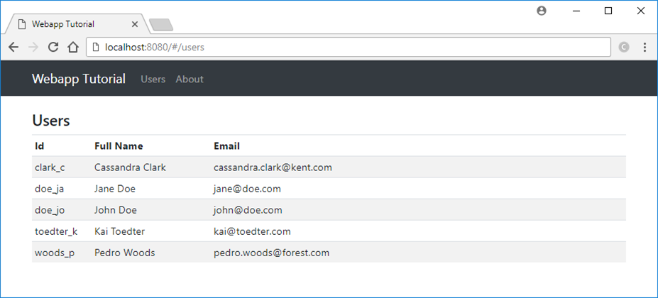

= WebApp Tutorial

image:https://github.com/toedter/webapp-tutorial/workflows/Build/badge.svg["build", link="https://github.com/toedter/webapp-tutorial/actions"]
image:http://img.shields.io/badge/license-MIT-blue.svg["MIT", link="http://toedter.mit-license.org"]
image:http://img.shields.io/badge/Gitpod-code%20now-blue.svg?longCache=true["Start Workspace", link="https://gitpod.io#https://github.com/toedter/webapp-tutorial"]

This is tutorial material for building modern web apps with Spring Boot, Spring Data Rest, Angular and TypeScript.
You find the corresponding tutorial slides at
https://speakerdeck.com/toedter/modern-web-apps-with-spring-boot-angular-and-typescript[SpeakerDeck].

== Used Technologies

* https://adoptopenjdk.net/[Java (17 or later)] for the REST services
* https://www.typescriptlang.org/[Typescript] for the web client
* http://stateless.co/hal_specification.html[HAL] (Hypertext Application Language) for hypermedia
* https://spring.io/projects/spring-boot[Spring Boot] (+ Data, REST, HATEOAS)
* https://angular.io/[Angular] for web client
* https://junit.org/[JUnit] for Java unit and integration testing
* https://code.google.com/p/mockito/[Mockito] for Mocking
* https://www.gradle.org/[Gradle] as master build system
* https://nodejs.org[Node.js] & https://www.npmjs.com/[npm] for the web client build

== Requirements

* Java 17 (JDK) or later installed

You don't need to install Node.js and all the JavaScript tooling,
since those tools are installed automatically by the Gradle build.
It would be convenient to have those tools installed
if you want to use them directly instead of using the Gradle wrapper tasks.

* Optional: Node.js and npm installed

== Getting Started

When you want to run the tutorial locally, prepare all the labs:

* ./gradlew build (Linux/Mac)
* gradlew build (Windows)

This builds all the tutorial labs (Java parts + JavaScript parts), runs all the Java tests).

== License

MIT, see http://toedter.mit-license.org
